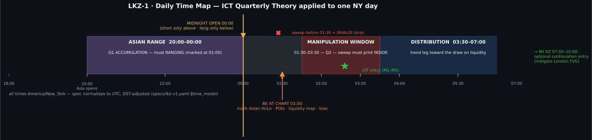
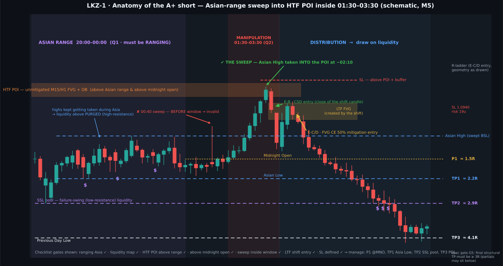
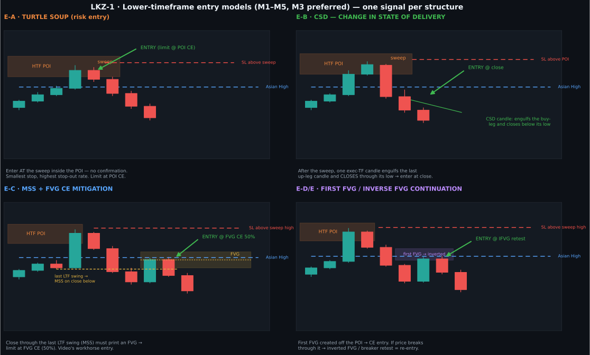
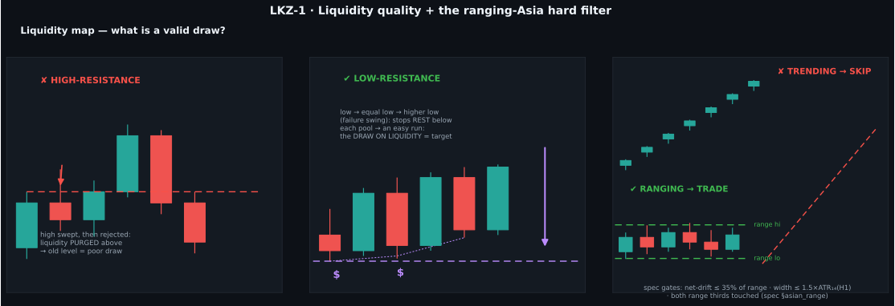

# LKZ-1 — ICT/SMC London Killzone · Asian-Range Sweep Strategy

| | |
|---|---|
| **Status** | `DRAFT` / research-only — **not** wired into any execution path |
| **Machine spec** | [`specs/lkz-v1.yaml`](../../specs/lkz-v1.yaml) (single source of truth for parameters) |
| **Diagram source** | [`scripts/generate_lkz_diagrams.py`](../../scripts/generate_lkz_diagrams.py) → [`assets/lkz/`](assets/lkz/) (PNG + SVG) |
| **Source material** | *"Ultimate ICT/SMC London Session Trading Strategy (Step By Step)"* — Mulham Trading, 2024-02-14 · [youtu.be/Ujtiqz4bLeU](https://www.youtube.com/watch?v=Ujtiqz4bLeU) (34:28) |
| **Governance** | research charter complied: six-question entry logged in [`reports/research_log.md`](../../reports/research_log.md) **before** any backtest. `engine_implements_spec: false` (safety interlock). v1 stays canonical for the live path; v3.5 stays version-of-record for promotion |
| **Skill cross-refs** | `.claude/skills/{session-filter, liquidity-sweep, fair-value-gap, order-block, inducement, choch-bos, entry-confirmation, premium-discount, risk-management, trade-management}` |

> **TL;DR** — During a **ranging Asian session (20:00–00:00 NY)**, liquidity builds on both
> sides. Between **01:30–03:30 NY** (Q2, the manipulation window) smart money sweeps one
> Asian extreme **into a higher-timeframe POI** that sits on the correct side of the
> **midnight open**. That sweep is reversed via one of five LTF entry models; the trade
> targets the opposite side of the range, then the **low-resistance liquidity pool**,
> then the previous day's extreme — with partials all the way and **≥3R** on the final
> structural target or **no trade**.

---

## 1 · Strategy at a glance (graphics)

**Fig. 1 — The daily time map.** Everything happens inside fixed New-York-time boxes;
the whole edge is *time × price confluence*.



**Fig. 2 — Anatomy of the A+ short.** One chart shows every gate: ranging Asia, liquidity
purged above (high-resistance), liquidity resting below (the draw), HTF POI above the
range and above the midnight open, the invalid pre-window sweep, the valid in-window
sweep, CSD + FVG-CE entries, SL placement and the P1→TP3 R-ladder (R values computed
from the drawn geometry).



**Fig. 3 — The five LTF entry models** (execution on M1–M5, M3 preferred):



**Fig. 4 — Liquidity quality + the Asian-range hard filter** — what counts as a valid
draw, and when the day is un-tradeable:



**Fig. 5 — Decision pipeline** (mirrors the spec's `state_machine`, five hard gates):


> All figures are schematic (no market data) and deterministic — regenerate with
> `python3 scripts/generate_lkz_diagrams.py`. PNG twins of every SVG sit in the same folder.

---

## 2 · Time model (all America/New_York, DST-adjusted)

| Time | Phase | Your job |
|---|---|---|
| 20:00–00:00 | **Asian range** (Q1 accumulation) | Nothing — let it build. Must be **ranging**, not trending |
| 00:00 | **Midnight open** | Mark the opening price of the 00:00 candle |
| ~01:00 | **Prep** | Mark Asian Hi/Lo, all POIs (FVG/OB/BB on M15–H4), liquidity map, decide preferred side |
| **01:30–03:30** | **Manipulation window** (Q2; core taught 01:30–03:00) | The **only** time a sweep is valid. High/low of the day often prints here (esp. Tuesday) |
| 03:30–07:00 | Distribution | Manage the position toward the draw |
| 07:00–10:00 | NY killzone | *Optional* continuation entry (§9) |

Sweeps that print **before 01:30 are invalid** — even when the POI reacted. The video
shows this twice; it is a hard rule, encoded as `sweep.sweeps_before_window_invalid: true`.

---

## 3 · Concepts used (glossary for humans *and* the code agent)

| Concept | Rule of thumb | Machine encoding (spec key) |
|---|---|---|
| **High-resistance liquidity** | extremity already swept & rejected → purged → poor draw, expect resistance | `liquidity_map.high_resistance` |
| **Low-resistance liquidity (LRLR)** | unswept **equal highs/lows** or **failure-swing chain** (low → higher low; high → lower high) → stops resting = the **draw on liquidity** | `liquidity_map.low_resistance`, `equal_level_tolerance_atr_mult` |
| **POI** | FVG (preferred), order block, breaker block on M15–H4; *"the candle that created the FVG is the order block"*; must be **unmitigated** | `poi.*` |
| **Midnight open (MNO)** | sell only **above** it, buy only **below** it — institutional "buy low, sell high" | `midnight_open.rule` |
| **Quarterly theory** | day splits into quarters; Q1 = accumulation (Asia), Q2 = manipulation (London KZ sub-quarters 01:30–03:00/–03:30), Q3/Q4 = distribution | `time_model.*` |
| **CSD** | change in state of delivery — the final root candle of the pre-sweep leg gets engulfed and closed through | `entry_models.E-B_csd` |
| **MSS / displacement** | close through the last LTF pivot with a displacement leg that prints an FVG | `entry_models.E-C_mss_fvg_ce`, `displacement.*` |
| **IFVG / breaker** | FVG closed through → inverts; retest = re-entry | `entry_models.E-E_ifvg_breaker` |

---

## 4 · The 01:00 pre-trade checklist (maps 1:1 to gates G1–G3)

1. **G1 — Asian range complete and ranging?** Width ≤ `1.5×ATR₁₄(H1)`, net drift ≤ 35 %
   of the range, both range thirds touched. Trending Asia → **done for the day**.
2. **G2 — Liquidity map:** mark Asian Hi/Lo, every equal-level pool and failure-swing
   chain, PDH/PDL. Is there a clean **low-resistance draw on ONE side** with enough
   distance (`min_draw_distance_atr_mult`)? No clean draw → done.
3. **G3 — POIs on the sweep side:** unmitigated FVG/OB/BB on M15–H4, **outside** the
   Asian range, **opposite the draw**, and on the right side of the **midnight open**
   (shorts above / longs below). If you run a daily-bias process, only trade with it.
   No valid POI → done.

You now know your preferred direction: **price must sweep INTO your POI to reach the
draw.** In the video's examples the failure-swing side usually telegraphed it
("liquidity is telling us what to take").

## 5 · G4 — the manipulation (the trigger)

Between **01:30 and 03:30 NY** you need **one** of:

- **Short:** wick beyond the **Asian High**, tagging the POI above the range (and above MNO).
- **Long:** wick beyond the **Asian Low**, tagging the POI below the range (and below MNO).

The sweep must clear the extreme (`≥ 0.05×ATR₁₄(M15)`) and **reach the POI** — a random
mid-air sweep is not a signal (video ex. 3: "there's no point of interest all the way
here" → no trade). Price then either closes back inside the range within 12 M5 bars or
goes straight into a trigger.

## 6 · LTF entry models (M1–M5, M3 ideal — "1m aggressive, 3m ideal, 5m max")

| ID | Model | Trigger | Entry | Character |
|---|---|---|---|---|
| **E-A** | Turtle soup | the sweep itself | resting limit at POI CE (50%) | risk entry: tightest stop, most stop-outs |
| **E-B** | CSD | exec-TF candle engulfs the last root candle of the pre-sweep leg + closes through its extreme | next bar open after the CSD close | video: "enter with the closure of this candle" |
| **E-C** | MSS + FVG CE | close through last LTF pivot with displacement → FVG printed | limit at **FVG CE (50%)** | the workhorse; FVG often aligns with a breaker block |
| **E-D** | First FVG | first FVG created from the POI after the sweep | limit at FVG CE (50%) | same idea without requiring the pivot close |
| **E-E** | IFVG / breaker | price closes **through** the E-D zone | limit at the inverted-FVG/breaker retest | continuation/re-entry |

One structure → one signal (`structure_key = [symbol, ny_date, side, poi_id, entry_model]`).
If the **draw was already taken** before you enter, skip — stale re-entries are low
probability (video ex. 1). Don't stack models; take the first qualifying one and journal
the rest.

## 7 · Stop, targets, management

**Stop loss** — beyond `max(POI high, sweep high) + 0.15×ATR` (short; mirrored for long).
If the POI is wider than `2.5×ATR`, fall back to **sweep extreme + buffer** ("give price
room to breathe"). Stops only tighten.

**The R-ladder** (in order):

| Level | Location | Action |
|---|---|---|
| **P1** | midnight open | partial **only if ≥1R away** ("if it's worth it"); moves SL→BE |
| **TP1** | opposite Asian-range extreme | partial |
| **TP2** | nearest low-resistance liquidity pool (failure swings / equal levels) | partial — the video's "sniper TP" zone |
| **TP3** | previous day extreme | runner |

**Discipline from the video:** stick to **3–5R**, take partials on the way, never chase
10–15R. Encoded: `min_rr_final_structural: 3.0` on the final planned level (gate G5),
partials 25/25/25/25 by default, time-stop 12 h, 1 trade/day, 1 position max.

## 8 · Risk & safety envelope (repo-level, unchanged)

DEMO-only execution (server name must contain "Demo"), fail-closed, kill-switch,
spread/staleness guards. Risk 0.5 %/trade (demo default), daily loss cap 2 %,
weekly 5 %, portfolio heat 4 %, drawdown cap 12 %. No live auto-trading until the
CHARTER promotion gates pass — this spec doesn't change that. **Nothing here is
financial advice; this is a research transcription of a public video.**

## 9 · Optional NY-continuation model

When the London model completed manipulation + distribution, the NY killzone
(07:00–10:00) frequently pulls back to **mitigate the M15 FVG created by the London
distribution leg** before continuing (video ex. 2). Same entry/SL/TP logic toward the
day's draw. `ny_continuation.enabled: false` until the core model validates.

## 10 · The video's three worked examples (condensed)

1. **Short (2 days before upload):** Asia's highs kept getting swept (high-resistance
   above); failure-swing lows below = draw. Price swept the Asian high *into* the only
   POI (unfilled M15 FVG+OB, above MNO) at ~02:10. CSD entry → ~5:1; FVG-CE entry → ~3:1;
   runner toward previous-day low ≈ 10:1 (before partials). A sweep at ~00:40 was
   explicitly invalid (before window).
2. **Short (a month before upload):** equal lows below Asia = draw; POI = partially
   filled H1+M15 FVG above. Sweep at **01:54** (in window) → CSD entry ≈ 6:1 to the
   Asian low; MSS→FVG-CE entry also paid; NY session then mitigated the London FVG for
   a continuation short.
3. **Long:** below MNO, sweep of the Asian low + internal liquidity into a POI →
   CSD and FVG-fill entries → target the stacked failure-swing highs (trend-line
   liquidity), ≈ 4:1 to the first pool; "sniper TP, then price ran the whole LRLR
   ladder without us" — the video's warning to be satisfied with planned targets.

## 11 · How the code agent consumes this (machine contract)

Canonical parameters: **`specs/lkz-v1.yaml`** (never hardcode; `parameter_registry`
carries type/units/default/range/owner/tunable). The engine implements the
`state_machine` and evaluates gates in order — **any gate failure must emit NO-GO with
the gate id** (`fail_closed`).

```text
for each NY weekday (times via zoneinfo("America/New_York") -> UTC):
    G1: asian_range(20:00-00:00) complete and RANGING?            else NO_GO_DAY
    ctx = build_liquidity_map(pivots k=2, equal tol 0.10 ATR)
    G2: clean low_resistance draw on exactly one side?            else NO_GO_DAY
    pois = unmitigated FVG/OB/BB on M15..H4, outside range,
           opposite draw, correct side of midnight_open           (G3, bias filter opt.)
    wait manipulation_window 01:30-03:30:
        G4: sweep of asian extreme, >=0.05 ATR beyond, TAGS a POI? else keep waiting
        reject any sweep with timestamp < window_start (invalid)
    on G4: arm LTF trigger on E-A..E-E (first qualifying bar only)
    G5: SL = beyond max(poi_high, sweep_high)+buffer (or sweep extreme if poi wide)
        RR to final structural target >= 3.0?                      else REJECT_NO_RR
        size = risk_pct_demo * equity / sl_distance
    execute (DEMO only) -> manage: P1 partial @MNO if >=1R, ladder TP1..TP3,
        BE after P1, stops only tighten, time-stop 12h, weekend exit
    journal(structure_key, gate trace, screenshots, R) -> cooldown until next NY day
```

**Implementation checklist before any interlock flip** (all mandatory):
1. Build a research harness somewhere comparable to `src/signal_v35.py` quality, with
   unit tests per gate (trending/ranging fixture, pre-window sweep fixture, no-POI
   fixture, consumed-structure fixture).
2. Backtest through `backtest-researcher`; walk-forward + OOS per `validation` skill;
   compare against the v3.5 baseline (negative expectancy today) — pre-registered
   expectations already logged in `reports/research_log.md`.
3. Only then open a promotion discussion. `engine_implements_spec` stays `false` until (1)+(2).

## 12 · Out of scope / caveats

- Daily-bias computation, news filters, the PDF in the video description, crypto/24-7
  session variants (weekend gaps change the Asian-range definition — handle per-symbol).
- All price/RR numbers in the figures are **schematic pedagogy**, computed from the
  drawn geometry, not backtest results. No performance claim is made or implied —
  the source video's example R-multiples are the author's, unaudited.
- This document is a faithful, tightened transcription of the video; ambiguous spots
  (01:30–03:00 vs 01:30–03:30; "3m ideal") are resolved explicitly in the spec and
  marked tunable for research.
