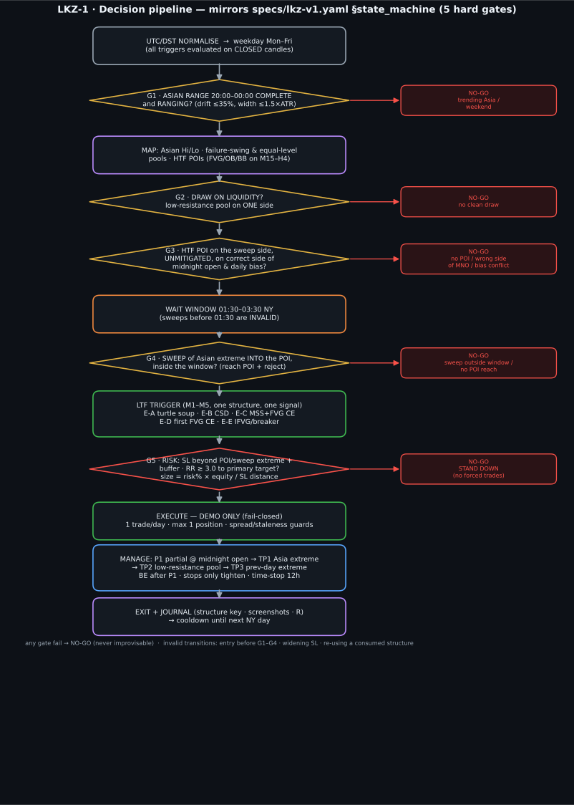

# LKZ-1 vs SMC-LSS v3.5 — Rules and Setup Comparison

| | LKZ-1 (video-derived London Killzone) | SMC-LSS v3.5 (repository research baseline) |
|---|---|---|
| **Human source** | [`ICT-SMC-LONDON-KZ-ASIAN-SWEEP-v1.md`](ICT-SMC-LONDON-KZ-ASIAN-SWEEP-v1.md) | [`SMC-LSS-v3.5-SIGNAL-RULESET.md`](SMC-LSS-v3.5-SIGNAL-RULESET.md) |
| **Machine contract** | [`specs/lkz-v1.yaml`](../../specs/lkz-v1.yaml) | [`specs/v3.5.yaml`](../../specs/v3.5.yaml) |
| **Research status** | `DRAFT`, research-only; no engine/harness yet | `RESEARCH_CANDIDATE`; formula engine and backtest harness exist |
| **May execute orders?** | No | No |
| **Purpose** | A narrowly timed, daily Asian-range liquidity-sweep reversal | A general multi-timeframe SMC cause → confirmation framework |

> **Comparison boundary:** this is a rules-and-setup comparison, not a performance
> comparison. Neither strategy is approved or eligible for live trading. The first
> fair performance test must use the same MT5 history, cost assumptions, fill rules,
> and out-of-sample partitions.



## 1. The core difference in one view

```text
v3.5:  HTF event (E1/E2/E3) → M5 confirmation (M1/M2/M3) → target/horizon

LKZ-1: ranging Asian range → clean draw → correct-side HTF POI →
       valid 01:30–03:30 NY sweep → LTF entry model → 3R structural target
```

**v3.5 asks:** “Did any of the defined higher-timeframe causes produce a valid M5
confirmation?”

**LKZ-1 asks:** “On this specific New York weekday, did a *ranging* Asian range build
liquidity, then get swept into the correct POI during the London manipulation window?”

Therefore, LKZ-1 is not merely a tighter v3.5 parameter set. It is a separate,
time-conditioned strategy family. Its central hypothesis is that rejecting most days
and most hours prevents the noise/overtrading seen in the recorded v3.5 baseline.

## 2. Rules comparison

| Decision area | v3.5 baseline | LKZ-1 | Practical consequence |
|---|---|---|---|
| **Trading time** | Its formal YAML spec does not make an Asian-range/day-phase sequence a prerequisite. The current `signal_v35.py` implementation contains fixed-UTC London/NY session checks, but the v3.5 YAML is less explicit about this setup. | NY weekday only; all schedule decisions use `America/New_York` with DST conversion. Asia: 20:00–00:00; sweep valid only 01:30–03:30. | LKZ-1 should issue far fewer signals and avoids a fixed-UTC DST mismatch. |
| **Day qualification** | No mandatory “Asia must be ranging” gate. | **G1:** Asian width ≤ 1.5× H1 ATR(14), net drift ≤ 35% of range, and both upper/lower thirds touched. A trending Asia is a no-trade day. | LKZ-1 intentionally removes trend-day reversals. This is its largest selectivity change. |
| **Higher-timeframe cause / POI** | E1: D1 FVG fill/reaction at H1; E2: H1 POI reaction; E3: H1 external-liquidity sweep/reclaim. | **G3:** fresh FVG (preferred), order block, or breaker block on M15/H1/H4; outside the Asian range; opposite the intended draw; maximum age 72 H1 bars. | v3.5 is organized by three generic causes; LKZ-1 requires a location relative to *today’s* range and liquidity map. |
| **Liquidity objective** | A pre-selected DOL/target source must exist, but no mandatory low-resistance-liquidity classification in the v3.5 YAML. | **G2:** exactly one clean low-resistance draw: unswept equal highs/lows or a failure-swing chain. Swept/rejected liquidity is high resistance and must not be the draw. | LKZ-1 has a more restrictive, explicit target-quality rule. |
| **Midnight open** | Mentioned for one source variant/target context, not a universal direction rule. | Required: sell only above midnight open; buy only below it. | LKZ-1 rejects otherwise structurally plausible trades on the wrong side of the daily reference. |
| **Sweep timing** | E3 has a general H1 external-liquidity sweep/reclaim; it is not tied to a London manipulation window in the v3.5 contract. | **G4:** Asian high/low must be swept ≥0.05 ATR, tag the POI, and reclaim within 12 M5 bars; any sweep before 01:30 or after 03:30 NY is invalid. | A pre-London sweep cannot be “rescued” by a later entry under LKZ-1. |
| **Entry confirmation** | Three M5 models: M1 inducement + CHoCH; M2 OB/FVG Gold Zone; M3 sweep + displacement + IFVG ≥50% retrace. | Five M1–M5 models (M3 preferred): E-A Turtle Soup/POI CE, E-B CSD, E-C MSS + FVG CE, E-D first FVG CE, E-E IFVG/breaker retest. | The methods overlap around FVG/IFVG and displacement, but LKZ-1 adds CSD/Turtle Soup and ties every entry to its G1–G4 context. |
| **Entry deadline** | Varies with the E/M setup and frozen holding horizon; no one daily sweep-to-entry limit in the YAML. | First qualifying LTF model after G4; maximum 60 M5 bars from sweep to entry; one signal per structure. | LKZ-1 prevents late re-entries after the reversal context becomes stale. |
| **Stop loss** | Beyond the invalidation structure for M1/M2/M3 plus symbol buffer. | Beyond `max(POI high, sweep high) + 0.15×ATR` (mirror for long); use sweep extreme if POI width > 2.5×ATR. | Both are structure-invalidated stops. LKZ-1 makes the POI/sweep hierarchy and wide-zone fallback explicit. |
| **Minimum reward/risk** | Minimum 2R to the pre-selected primary DOL. | Minimum 3R to the **final structural** target (TP3); intended 3–5R. | LKZ-1 is more selective, but a 3R threshold can reduce samples substantially. |
| **Targets / exits** | 1R management partial plus one pre-selected primary DOL; horizon frozen at 12/24/120 hours by variant. | P1 at midnight open if ≥1R, then opposite Asia extreme, LRLR pool, previous-day extreme; 25/25/25/25 partial ladder, BE after P1/1R, 12-hour stop. | A fair test must model partial exits rather than score one strategy at full target and the other at a ladder. |
| **Frequency limits** | `max_positions: 3`; no explicit one-trade-per-day cap in `specs/v3.5.yaml`. | One trade/day, one position, one signal/structure; optional NY continuation disabled. | LKZ-1 directly addresses v3.5’s observed high signal counts. |
| **Risk envelope** | 0.5% demo risk; 3% daily loss; 4% portfolio heat. | 0.5% demo risk; 2% daily, 5% weekly, 4% heat, 12% drawdown cap. | LKZ-1 is stricter on daily loss and adds weekly/drawdown constraints. |
| **Crypto applicability** | Includes a BTCUSD profile and an observed BTCUSDT E2M3 example. | Uses a weekday NY session despite BTC trading 24/7; crypto-specific weekend/session behavior is explicitly out of scope. | Do **not** assume EURUSD results transfer to BTCUSD. BTCUSD requires a separately reported, possibly rejected/inconclusive, result. |

## 3. Setup flow for each strategy

### v3.5 setup

1. Load closed M5 candles plus H1 context; add D1 context for E1.
2. Detect an E-trigger: D1 gap reaction (E1), H1 POI reaction (E2), or H1 external sweep/reclaim (E3).
3. Detect an M5 confirmation/entry model: M1, M2, or M3.
4. Resolve direction from the reaction, calculate the model-specific stop, and require a pre-selected DOL.
5. Reject when no DOL exists or reward/risk is below 2R.
6. Simulate/manage within the variant’s frozen 12-, 24-, or 120-hour horizon.

### LKZ-1 setup

1. Convert UTC candles to **America/New_York** for session decisions; skip weekends.
2. Build the 20:00–00:00 Asian range and apply **G1**. Stop for the day if it is trending.
3. Map low- and high-resistance liquidity; require exactly one clean draw (**G2**).
4. Find fresh M15/H1/H4 POIs on the required side of the Asian range and midnight open (**G3**).
5. During 01:30–03:30 only, wait for an Asian extreme sweep that penetrates, tags the POI, and reclaims (**G4**).
6. Take only the first valid LTF E-A…E-E model; reject a stale or consumed structure.
7. Compute the stop, model the partial-target ladder, and require ≥3R to TP3 (**G5**).
8. Enforce one trade/day, 12-hour time stop, break-even/partial management, and no stop widening.

## 4. What overlaps and what does not

### Shared foundations

- Closed-candle decisions, no look-ahead.
- Multi-timeframe SMC: liquidity, POIs, FVGs, order blocks, sweeps, displacement.
- Structure-based stop beyond invalidation.
- A target must be identified before entry.
- Stop widening is prohibited; both remain research-only.

### LKZ-1 additions that v3.5 does not enforce as a complete sequence

1. Ranging-Asian-session qualification.
2. DST-aware New York clock and a hard 01:30–03:30 sweep window.
3. Low-resistance target classification plus high-resistance exclusion.
4. Mandatory POI location relative to the Asian range and midnight open.
5. One trade per day and explicit P1→TP3 partial ladder.

### v3.5 capabilities that LKZ-1 deliberately does not cover yet

1. Multiple holding styles: intraday, overnight, intraweek, and runner horizons.
2. General HTF setups outside the London manipulation context.
3. A broader cross-instrument E×M taxonomy, including crypto’s H1/intraweek example.
4. A working (but not approved) formula/backtest code path.

## 5. Fair backtest design — required before conclusions

The two strategies **cannot be compared by simply running the existing v3.5 runner
against an LKZ signal counter**. The outcome model must be equivalent.

| Control | Required comparison rule |
|---|---|
| **Data** | Same MT5/broker OHLC feed, symbols, UTC timestamps, and fixed completed window: 2025-07-20 through 2026-07-19. |
| **Execution timeframe** | Use M5 first for both strategies. This is conservative for LKZ-1, whose source prefers M3; do not silently mix M3 LKZ entries with M5 v3.5 entries. |
| **Context aggregation** | Derive/validate M15, H1, H4, and D1 consistently from the same canonical feed. |
| **Costs** | Apply the same symbol-specific spread, commission, and slippage assumptions to both. Report assumptions in the output. |
| **Intrabar collisions** | Apply the same conservative rule when SL and target are touched within one bar (stop first, unless tick data proves ordering). |
| **Partial exits** | Either implement the LKZ partial ladder and an equivalent v3.5 management model, or report a clearly labelled *normalized full-exit sensitivity test* for both. Never compare an LKZ ladder return to a v3.5 full-target return as if they were identical. |
| **No overlap** | Define a shared position-overlap rule and apply each strategy’s own frequency limits. |
| **Partitions** | Pre-register one split, e.g. first 8 months in-sample / final 4 months OOS, then add rolling walk-forward. No tuning using OOS. |
| **Verdict** | Require at least 30 trades to call a result informative; accept only if OOS expectancy > 0 and OOS is at least half of IS expectancy. |

## 6. Recommendations before the data backtest

1. **Keep LKZ-1 separate from v3.5 for the first test.** Do not merge gates into v3.5 yet; that would hide which hypothesis caused any improvement.
2. **Test EURUSD first, then BTCUSD as a separate robustness test.** LKZ-1 is designed around FX’s London/New York rhythm. BTCUSD’s 24/7 market and weekend behavior are a known specification gap, not a minor parameter difference.
3. **Build a gate-trace, not just signals.** Each LKZ day must record why it passed/failed G1–G5. This will identify whether poor performance comes from Asian classification, POI selection, sweep/reclaim, LTF trigger, or target construction.
4. **Use the same management accounting.** The likely source of a misleading comparison is target handling: v3.5’s current runner records one primary target, while LKZ-1 specifies four partial exits.
5. **Do not tune thresholds after looking at the first year.** Any change to LKZ parameters must receive a new pre-registered research-log entry before another run.
6. **Do not promote either strategy from this comparison.** This is a research screen only; the safety interlocks remain false until reproducible OOS/walk-forward evidence passes.

## 7. Current implementation reality

| Component | v3.5 | LKZ-1 |
|---|---|---|
| Human rules | Present | Present |
| Machine-readable spec | Present | Present |
| Formula/signal code | Present (`src/signal_v35.py`) | Not implemented |
| Backtest harness | Present (`src/backtest_v35.py`) | Not implemented |
| Unit tests | Present, subject to local data availability | Must be built per gate |
| Live execution authorization | Blocked | Blocked |

The next technical deliverable is therefore an **LKZ-1 research harness plus unit
fixtures**, then a common, reproducible comparison runner after the MT5 exports are
available. This document does not alter either spec or strategy parameter.
