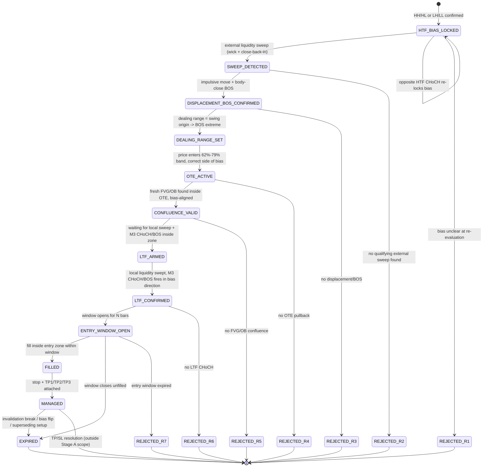

# ST-C3 Funnel Overhaul Plan — Daily Price Action Deterministic Funnel

**Status:** PLANNING DOCUMENT. Not a specification freeze, not implementation
authorization, not a `MASTER_PLAN.md`/`NEXT_ACTION.md` amendment.
**Scope:** ST-C3 only. Does not modify, pause, or reinterpret
`specs/st-c2_v1.2.0.yaml` (frozen) or ST-C2's active S1-G2 milestone.
**Governance basis:** `docs/adr/ADR-0004-st-c3-candidate-intake.md`,
`reports/research_log.md` ("ST-C3 v1.0.0 candidate intake" entry),
`specs/st-c3_v1.0.0.yaml` (draft).
**Date:** 2026-07-24.

---

## 0. What this plan is, and is not

The owner asked for a complete overhaul plan covering strategy architecture,
funnel lifecycle, entry/SL-TP/risk/bias/confluence/execution/validation
models, agent prompts, state machine, rejection codes, evidence IDs,
trade-plan object, expiry logic, numeric thresholds, golden-case plan,
governance alignment, backtest/walk-forward plan, and diagrams — "ready for
implementation."

This document delivers all 20 sections **as a plan**, scoped to ST-C3, for
three governance reasons that make a literal "overhaul all documents" pass
impossible as stated:

1. **`specs/st-c2_v1.2.0.yaml` is frozen and immutable.** Nothing here
   revises it. Every design choice below is native to ST-C3.
2. **`MASTER_PLAN.md`'s Stage A/B gate template (S1-G1..G10, S2-G1..G3) is
   already candidate-agnostic** — it is reused per candidate, not owned by
   ST-C2. This plan reuses the same gate names, qualified `ST-C3 S1-Gn`, and
   proposes no edit to `MASTER_PLAN.md` itself. `MASTER_PLAN.md`'s "Current
   Lifecycle Position" table is presently single-slot (tracks one active
   strategy); extending it to track ST-C3 in parallel with ST-C2 is a
   governance step this plan recommends (§18) but does not perform.
3. **New agent files require their own ADR**, per the ADR-0002/ADR-0003
   precedent ("any future agent claiming governance/enforcement authority
   requires its own ADR ... not an assumption that this ADR opens the door
   generally"). §10 below is therefore six **agent prompt specifications**,
   not six new files in `.claude/agents/`.

Nothing in this document grants implementation, backtest, execution, demo,
or production authority for ST-C3. `NEXT_ACTION.md` continues to name ST-C2
v1.2.0 S1-G2 closure as the sole active execution/implementation milestone
until a separate governance step authorizes ST-C3 S1-G1 work.

---

## 1. Updated Strategy Architecture

ST-C3 is a single-pass, top-down deterministic funnel: each stage either
produces evidence that the next stage consumes, or terminates the setup with
a rejection code. There is no backtracking and no discretionary override —
this mirrors ST-C2's own `require_all_stages_pass: true` philosophy
(`specs/st-c2_v1.2.0.yaml` §5), applied to a different stage sequence and
timeframe triad.

```text
F1 (1D FVG/OB reaction)   \
F2 (1H POI reaction)       >  funnel-stage context clusters (ADR-0004 relabel
F3 (5M liquidity sweep)   /   of the owner's original E1-E3 shorthand)

HTF Bias (H4)
  -> External Liquidity Sweep (H4/M15)
    -> Displacement + BOS (M15)
      -> Dealing Range + OTE (M15)
        -> FVG/Order-Block Confluence (H4/M15)
          -> LTF Confirmation (M3 CHoCH/BOS)
            -> Entry Window (deterministic, N bars)
              -> Structural Invalidation Stop
                -> TP1 / TP2 / TP3 Liquidity Targets
                  -> Expiry Logic
```

**Primary components** (now also recorded as descriptive metadata in
`specs/st-c3_v1.0.0.yaml` §0, `architecture:` block):

- HTF bias engine
- Funnel state machine
- Evidence layer
- Trade-plan generator
- Risk & SL/TP module
- Validator & rejection system

These six map directly onto the Layer 0-6 breakdown below and onto the four
proposed evidence/rejection/trade-plan/validator agents in §10 — deliberately
the same shape, described twice (component view here, agent-role view in
§10) because one is the software architecture and the other is the
governance-scoped proposal for who/what implements it.

Architecturally this is the same three-tier timeframe pattern ST-C2 uses
(`htf: H4`, `mf: M15`, `ltf: M3`) — not a coincidence, both trace to the same
Daily Price Action reference material (`docs/reference/smc-*-dailypriceaction.md`)
— but ST-C3 is its own contract: own rejection-code namespace, own evidence
schema, own TP model (fixed 3-tier liquidity ladder vs. ST-C2's 2-tier
`t1_liquidity`/`t2_deeper_liquidity`), own OTE band source (62%-79% per the
reference guide vs. ST-C2's ratified 50%-78.6% band). Reusing the pattern is
architecturally efficient; reusing the *file* would violate immutability.

**Component layering (mirrors ST-C2's proven separation):**

```text
Layer 0: Symbol/session metadata     (specs/st_c3/symbol_metadata.yaml — TBD)
Layer 1: Primitive calculations      (candle body/wick/range, point normalization)
Layer 2: Structural detectors        (swings, BOS, CHoCH, liquidity pools, sweeps)
Layer 3: Zone detectors               (OTE band, FVG, order block)
Layer 4: Confirmation/state machine   (LTF CHoCH inside zone, entry window)
Layer 5: Trade-plan assembly          (SL/TP/RR, evidence bundle, VALID/REJECTED)
Layer 6: Diagnostics                  (rejection-code + evidence-ID logging)
```

Layers 0-4 are pure functions of OHLC history (no broker, no live state) —
same non-repainting, causal-cutoff discipline `docs/RESEARCH-CHARTER.md` and
ST-C2's golden-case tests already enforce. Nothing above Layer 5 exists until
S1-G2-equivalent work is authorized for ST-C3.

**Open flag, not adopted:** a later restatement of this architecture
described the LTF tier as "M3/M1" rather than the owner's originally
specified M3-only ("M3 CHoCH/BOS", stated three times in the original
funnel prompt). `specs/st-c3_v1.0.0.yaml` `timeframes.ltf` remains `M3`
unchanged — widening it to include M1 is a rule change, not a documentation
cleanup, and needs an explicit owner decision at S1-G1 rather than being
inferred from a summary restatement.

---

## 2. Updated Funnel Lifecycle

Already captured structurally in `specs/st-c3_v1.0.0.yaml` §3 (`pipeline:`).
Restated here as the canonical 10-stage sequence with per-stage pass/fail
contract:

| # | Stage | Pass condition | Fail -> rejection code |
|---|---|---|---|
| 1 | HTF Bias (H4) | HH/HL or LH/LL confirmed, locked until opposite HTF CHoCH | `ST-C3-R1` |
| 2 | External Liquidity Sweep (H4/M15) | wick through external level, close back inside range | `ST-C3-R2` |
| 3 | Displacement + BOS (M15) | impulsive move + body-close BOS beyond structure | `ST-C3-R3` |
| 4 | Dealing Range + OTE (M15) | price retraces into 62%-79% band on the correct side of bias | `ST-C3-R4` |
| 5 | FVG/OB Confluence (H4/M15) | fresh FVG or OB, inside OTE, aligned with HTF bias | `ST-C3-R5` |
| 6 | LTF Confirmation (M3) | local-liquidity sweep + CHoCH/BOS in bias direction, inside the zone | `ST-C3-R6` |
| 7 | Entry Window | fill occurs within N bars of the LTF CHoCH | `ST-C3-R7` |
| 8 | Structural Invalidation Stop | stop anchored to the M3 swing that formed the CHoCH | (no independent reject — stop placement failure folds into R6/R7) |
| 9 | TP1/TP2/TP3 | all three targets resolvable from existing liquidity evidence | (folds into trade-plan `status: REJECTED` if no valid target chain) |
| 10 | Expiry | any of: invalidation break, window close, bias flip, newer setup supersedes | terminal — not a rejection, a lifecycle end state |

Every stage transition is one-directional; there is no re-entry into an
earlier stage for the same candidate setup (matches ST-C2's
`bos_choch_mutual_exclusivity` / `classification_authority: prior_confirmed_bias`
discipline in spirit, applied to ST-C3's own stage set).

---

## 3. Updated Entry Model

- **Entry zone:** MF/LTF FVG or a refined order block, both required to sit
  inside the confluence zone validated at stage 5.
- **Entry trigger:** the LTF CHoCH/BOS event itself (stage 6) is the trigger;
  stage 7's entry window is a deterministic *cutoff*, not an additional
  discretionary trigger.
- **Entry price anchor:** proposed `ltf_fvg_proximal_boundary` (same
  convention as ST-C2 `execution_stage.entry.price_anchor` — proven pattern,
  independently adopted for ST-C3, not inherited by reference) —
  `UNRESOLVED` in the frozen sense, `PROVISIONAL` as a starting point for
  S1-G1.
- **Entry type:** limit order into the entry zone, confirmation-required
  before placement (no anticipatory fill ahead of the LTF CHoCH).
- **Duplicate-setup handling:** one position at a time per symbol,
  rejected duplicates still logged (ST-C2 precedent,
  `duplicate_setup_policy`/`duplicate_setup_log_only`) — proposed, not
  decided, for ST-C3.

---

## 4. Updated SL/TP Model

**Stop-loss** — structural invalidation only, never arbitrary:

- Short: above the M3 swing that formed the CHoCH.
- Long: below the M3 swing that formed the CHoCH.
- Buffer: `UNRESOLVED` (owner gave no numeric buffer). Proposed provisional
  starting point: 2 points, mirroring ST-C2's `buffer_pips: 2` order of
  magnitude — **explicitly flagged for independent ratification**, not
  copied as decided.

**Take-profit — fixed 3-tier liquidity ladder** (this is the part of ST-C3
that differs most from ST-C2's 2-tier model):

| Target | Definition | RR floor |
|---|---|---|
| TP1 | Internal liquidity: prior swing / internal liquidity pocket | 3.0 (owner-stated, stated twice, consistent) |
| TP2 | External liquidity: equal highs/lows, major liquidity pool | `UNRESOLVED` — proposed provisional 5.0 (external liquidity is by definition farther than internal; must exceed TP1's floor) |
| TP3 | HTF objective: H4 swing, deeper liquidity target | `UNRESOLVED` — proposed provisional 8.0, `enabled: false` by default (mirrors ST-C2's own `t3_extension.enabled: false` caution) |

`target_selection_policy`: proposed `both_tp1_and_tp2_mandatory_pre_entry`
(ST-C2 precedent) — a trade lacking either a valid TP1 or TP2 objective is
rejected before entry, not entered and hoped for. TP3 is a runner extension,
not a mandatory pre-entry objective, consistent with `enabled: false`.

---

## 5. Updated Risk Model

`specs/st-c3_v1.0.0.yaml` §6 currently marks every risk field `UNRESOLVED`
except `min_rr: 3.0` (owner-derived from TP1). This plan does not resolve
them — risk parameters are exactly the kind of number `docs/CHARTER.md`'s
operational risk envelope and this project's promotion-gate discipline
require independent, evidence-based sign-off for, not inheritance from
another candidate's tightened values.

Proposed **provisional working ceiling**, bounded by `docs/CHARTER.md`'s
existing floor/ceiling (2.0 min RR, 4% portfolio heat) the same way ST-C2's
values are cross-checked against it:

| Field | ST-C3 proposed provisional | Cross-check |
|---|---|---|
| `per_trade_risk_pct` | 0.5 | matches CHARTER's demo figure |
| `min_rr` | 3.0 | owner-stated; stricter than CHARTER's 2.0 floor |
| `max_positions` | 3 | matches CHARTER |
| `portfolio_heat_pct` | 3.0 | stricter than CHARTER's 4% ceiling |
| `daily_loss_pct` | 3.0 | matches CHARTER |
| `weekly_loss_pct` | 7.0 | no CHARTER equivalent |

These numbers are proposed *because they are already CHARTER-consistent*,
not because they are correct for ST-C3's actual trade distribution — that
determination belongs to S1-G1 spec audit and, eventually, A3 statistical
validation, exactly as it did for ST-C2.

---

## 6. Updated Bias Model

- **Classifier:** structure-only (HH/HL/LH/LL via confirmed BOS/CHoCH) — no
  EMA, swing-count, or regression-slope alternative, matching ST-C2's ratified
  `bull_bear_classification_rule: htf_bos_and_choch_only` philosophy,
  independently proposed for ST-C3.
- **Lock policy:** bias locks on first qualifying HTF CHoCH, persists until
  an opposite HTF CHoCH invalidates it. No trade is permitted against locked
  bias (owner's rule, non-negotiable per the funnel prompt).
- **Evidence timestamping:** every bias decision carries a
  `bias_evidence_timestamp` referencing the structural event that produced
  it (BOS or CHoCH) — direct application of ST-C2's own audit-trail pattern,
  independently required for ST-C3 rather than copied by reference.

---

## 7. Updated Confluence Model

- **Required:** fresh H4 or M15 FVG **or** fresh H4/M15 order block, and it
  must sit inside the OTE zone from stage 4, and it must align with locked
  HTF bias.
- **Freshness definition:** `UNRESOLVED` — the owner said "fresh" with no
  max-age bar count. Proposed provisional: `max_age_bars: 40`, matching the
  order of magnitude of ST-C2's `poi_gap_reaction.gap_max_age_bars_htf: 40`
  — flagged, not decided.
- **Multi-zone tie-break:** proposed `highest_timeframe_priority` (H4 zone
  wins over M15 when both qualify) — ST-C2 precedent, proposed fresh for
  ST-C3.
- **Cascade invalidation:** proposed `true` — if the FVG or OB invalidates
  before entry, the whole confluence result fails rather than silently
  falling back to the other zone type.

---

## 8. Updated Execution Model

Execution model here means *signal-to-trade-plan* assembly, not order
routing — ST-C3 has **zero** broker/execution authority at any stage of
Stage A, identical to ST-C2's posture (`docs/CHARTER.md`, Hard Rule "No
broker integration during Stage A").

- Same-bar priority: proposed `stop_first` (ST-C2 precedent) — if stop and
  target could both trigger on the same bar, stop resolves first, preventing
  an invalid "both hit" state.
- Post-fill event ordering: proposed `[stop, target, management, diagnostics]`
  (ST-C2 precedent).
- Gap-through handling, partial-fill policy: `UNRESOLVED`, deferred to S1-G1.
- **Cost model:** must use `config/research_costs.yaml` per-symbol rows and
  `fail_closed` on a missing profile — this is a platform-wide convention
  (`specs/st-c2_v1.2.0.yaml` §3.6 `cost_model`), not an ST-C2-specific rule,
  and applies to ST-C3 unchanged once a symbol scope exists.

None of this is implementation. It is the schema an eventual reference
kernel would need to satisfy, exactly as ST-C2's execution_stage block was
written before any engine existed.

---

## 9. Updated Validation Model

ST-C3 reuses `MASTER_PLAN.md`'s existing, candidate-agnostic Stage A/B gate
template verbatim — no new gate names are invented, only qualified by
candidate:

| Stage | Gate | ST-C3 purpose |
|---|---|---|
| A1 | ST-C3 S1-G1 | Freeze this plan's `UNRESOLVED`/`PROVISIONAL` fields into a decided, frozen `specs/st-c3_v1.1.0.yaml` (or ratify v1.0.0 in place while still draft) |
| A1 | ST-C3 S1-G1C | Logic-conformance closure against the frozen spec |
| A2 | ST-C3 S1-G2 | Minimum reference kernel + existence check (same authorization shape ST-C2 received: golden-case tests, conformance kernel, minimum detector slice, existence-check run only) |
| A2 | ST-C3 S1-G3 | Primitive/indicator conformance |
| A2 | ST-C3 S1-G4 | Event/state conformance (BOS, CHoCH, sweep, FVG, OB detectors + state machine) |
| A2 | ST-C3 S1-G5 | Signal/trade-plan conformance |
| A2 | ST-C3 S1-G6 | Golden-case qualification |
| A3 | ST-C3 S1-G7 - S1-G10 | Historical baseline, cost-adjusted, walk-forward/OOS, robustness |
| Stage B | ST-C3 S2-G1 - S2-G3 | Execution dev, demo, production — blocked by definition until A1-A3 all pass |

**Current ST-C3 gate position: pre-S1-G1.** This plan is S1-G1 preparation
material, not the S1-G1 act itself — that act requires governance review
(project-governance-agent and/or owner) and a `NEXT_ACTION.md` change, per
ADR-0004 §4.

---

## 10. Updated Agent Prompts — PROPOSAL ONLY, requires its own ADR

Per the ADR-0002/ADR-0003 precedent, **no new agent files are created by
this plan.** What follows are six proposed agent prompt specifications,
mechanically scoped the same way the three existing ST-C1 agents are scoped
(classification / conformance-enforcement / strategy-governance, none
holding meta-governance authority) — ready to be formalized in a future
`ADR-0005` if the owner wants them built.

1. **`st-c3-pm-agent` (proposed)** — tracks ST-C3's gate position, evidence
   register, and blocking-gaps list (role parallel to how `NEXT_ACTION.md` /
   `PROJECT_STATUS.md` are maintained for ST-C2, scoped to ST-C3 only). Does
   not approve gates, does not write `MASTER_PLAN.md`.
2. **`st-c3-strategy-agent` (proposed)** — holds ST-C3's frozen-spec rules of
   record post-S1-G1; answers "what does the spec require here" questions.
   Cannot modify the spec once frozen; cannot approve exceptions.
3. **`st-c3-validator-agent` (proposed)** — mechanical stage-by-stage
   pass/fail evaluation against a candidate setup (parallel to
   `st-c1-conformance-kernel-agent`: enforces, never creates, rules).
4. **`st-c3-trade-plan-agent` (proposed)** — assembles the `TRADE_PLAN`
   object (§14) from validator output; pure data assembly, no judgment calls.
5. **`st-c3-evidence-agent` (proposed)** — issues and validates stable
   evidence IDs (§13); ensures ID composition is deterministic and
   collision-free against ST-C1/ST-C2's existing ID space.
6. **`st-c3-rejection-agent` (proposed)** — maps a stage failure to its
   `ST-C3-Rn` code, reason, evidence IDs, and failure stage (§12); pure
   lookup/formatting, no discretion.

Every one of these six, like the ST-C1 trio, would be explicitly barred
from: overriding `project-governance-agent`; modifying `specs/*.yaml`
detection logic without an RCR; creating further agent files; modifying
ADRs, `MASTER_PLAN.md`, `ROADMAP.md`, or `NEXT_ACTION.md`; and resolving
(rather than escalating) session/spec-config conflicts.

**Two additional integration roles were proposed in a later restatement —
both land on opposite sides of the Stage A/B boundary, and only one is
in scope for anything this plan can authorize:**

7. **Execution agent (Stage B only — not proposed for authorization at any
   point in this plan).** "Consumes TRADE_PLAN and places/demo trades" is,
   by definition, broker integration and demo trading — blocked during
   Stage A by `MASTER_PLAN.md` Governance Rules 3-4 and CLAUDE.md's Hard
   Rules, for every candidate, not just ST-C3. It has no role until an
   Approved Strategy Package exists (§9, Strategy Approval) and Stage B
   S2-G1 is reached. Recorded here purely as a future integration point,
   the same way `specs/st-c2_v1.2.0.yaml`'s own execution-stage fields
   describe a schema without an engine.
8. **Journal agent (proposed, Stage-A-safe subset only).** Logging rejected
   and valid setup evidence (`diagnostics.record_rejected_setups: true`,
   already in `specs/st-c3_v1.0.0.yaml` §7) is Stage A-appropriate —
   it is pure diagnostics on synthetic/historical setups, no broker
   involved. Logging *live or demo trade outcomes* is a different,
   Stage B-only responsibility already covered by the platform's existing
   `trade-journal-analyst` skill pattern for closed trades — this proposed
   agent would only ever own the Stage A half unless re-scoped by its own
   future ADR.

---

## 11. Updated State Machine



Design constraints for the eventual implementation (S1-G4 territory, not
built here): every state transition must be deterministic given only the
OHLC history up to the current bar (no lookahead), and every `REJECTED_*`
and `EXPIRED` terminal state must log its full evidence bundle per
`diagnostics.record_rejected_setups: true`.

---

## 12. Updated Rejection Code System

Already ratified in `specs/st-c3_v1.0.0.yaml` §4 and ADR-0004 (namespaced to
avoid the ST-C2/ST-C1 collisions found during intake review):

| Code | Meaning | Stage |
|---|---|---|
| `ST-C3-R1` | HTF bias unclear | 1 |
| `ST-C3-R2` | No external sweep | 2 |
| `ST-C3-R3` | No displacement/BOS | 3 |
| `ST-C3-R4` | No OTE pullback | 4 |
| `ST-C3-R5` | No FVG/OB confluence | 5 |
| `ST-C3-R6` | No LTF CHoCH | 6 |
| `ST-C3-R7` | Entry window expired | 7 |

**Coverage gap, carried forward from the owner's original spec** (flagged,
not resolved, same honesty discipline ST-C2's own §6 uses for its coverage
gap): no distinct code exists yet for stop-invalidity, insufficient
net-RR-after-cost, missing cost profile, or missing TP1/TP2 objective. These
either need `ST-C3-R8`+ codes or an explicit "folds under R6/R7" decision at
S1-G1 — left open here deliberately rather than invented.

Every rejection, per the owner's original requirement, must carry: code,
reason, evidence IDs, and the funnel stage where failure occurred. This is a
hard interface requirement on the future validator/rejection agents (§10),
not optional logging.

---

## 13. Updated Evidence ID System

Evidence IDs (already listed in `specs/st-c3_v1.0.0.yaml`): `HTF_BIAS_ID`,
`HTF_SWING_ID`, `SWEEP_ID`, `LIQUIDITY_ZONE_ID`, `DISPLACEMENT_ID`, `BOS_ID`,
`DEALING_RANGE_ID`, `OTE_ZONE_ID`, `FVG_ID`, `ORDERBLOCK_ID`,
`LTF_SWEEP_ID`, `LTF_CHOCH_ID`, `ENTRY_WINDOW_ID`, `ENTRY_ZONE_ID`,
`INVALIDATION_SWING_ID`, `TP1_ID`/`TP2_ID`/`TP3_ID`, `EXPIRY_ID`.

**Proposed stable-ID composition** — directly reusing ST-C2's proven,
already-decided formula shape (`specs/st-c2_v1.2.0.yaml`
`stable_identifier_composition: sha256_of_structural_attributes`,
`stable_identifier_fields: [timestamp, high, low, swing_classification,
displacement_metrics]`), scoped to ST-C3's own namespace:

```text
evidence_id = "ST-C3:" + evidence_type + ":" +
              sha256(symbol, timeframe, timestamp, high, low,
                     structural_attributes)[:16]
```

The `"ST-C3:"` prefix is the collision guard — it ensures an
`ST-C3:SWEEP_ID:...` can never be mistaken for an ST-C2 or ST-C1 evidence
record even if the underlying structural attributes happen to coincide
(e.g. the same real-world sweep event detected independently by both
candidates' detectors during parallel research). This directly answers the
governance concern raised in ADR-0004 for rejection codes and cluster
labels — extended here to IDs, which weren't flagged as colliding but merit
the same guard proactively.

---

## 14. Updated Trade-Plan Object

Already schematized in `specs/st-c3_v1.0.0.yaml` §5. Restated as a concrete
JSON-shape example (illustrative, not a frozen wire format):

```json
{
  "trade_plan_id": "ST-C3:TRADE_PLAN:<sha256[:16]>",
  "direction": "SHORT",
  "htf_bias": "ST-C3:HTF_BIAS_ID:...",
  "sweep": "ST-C3:SWEEP_ID:...",
  "displacement": "ST-C3:DISPLACEMENT_ID:...",
  "bos": "ST-C3:BOS_ID:...",
  "dealing_range": "ST-C3:DEALING_RANGE_ID:...",
  "ote_zone": "ST-C3:OTE_ZONE_ID:...",
  "confluence_zone": ["ST-C3:FVG_ID:...", "ST-C3:ORDERBLOCK_ID:..."],
  "ltf_confirmation": "ST-C3:LTF_CHOCH_ID:...",
  "entry_zone": "ST-C3:ENTRY_ZONE_ID:...",
  "entry_window": "ST-C3:ENTRY_WINDOW_ID:...",
  "stop_loss": "ST-C3:INVALIDATION_SWING_ID:...",
  "targets": ["ST-C3:TP1_ID:...", "ST-C3:TP2_ID:...", "ST-C3:TP3_ID:..."],
  "expiry": "ST-C3:EXPIRY_ID:...",
  "rr": 3.4,
  "evidence": ["<all IDs above, flattened>"],
  "status": "VALID",
  "rejection": null
}
```

`rejection` is `null` for `status: VALID`; when `status: REJECTED`, it
carries `{"code": "ST-C3-R4", "reason": "...", "stage": "ote_stage",
"evidence": [...]}` — one object handles both outcomes rather than two
divergent schemas, matching the owner's original "no discretion, no missing
steps" framing.

---

## 15. Updated Expiry Logic

Triggers (owner-specified, already in `specs/st-c3_v1.0.0.yaml`
`expiry_stage`):

1. Invalidation breaks (price closes beyond the structural stop before
   fill).
2. Entry window closes unfilled.
3. HTF bias flips (opposite HTF CHoCH fires before fill or before TP1).
4. A new sweep + BOS creates a newer, superseding setup on the same symbol.

**Design note carried forward from ST-C2's own resolved ambiguity**
(`session_close_forces_exit: conditional_near_invalidation_only`): whether
session close should itself be a fifth expiry trigger is `UNRESOLVED` for
ST-C3 — the owner's list does not mention session close, and inventing a
fifth trigger by analogy would be exactly the kind of unrequested addition
`CLAUDE.md`'s scope-discipline rule prohibits. Left open for S1-G1, not
assumed.

---

## 16. Updated Numeric Thresholds

Consolidated table of every `UNRESOLVED` field in `specs/st-c3_v1.0.0.yaml`,
with this plan's proposed provisional value and its justification. **None of
these are decided.** They are S1-G1 starting proposals, each independently
falsifiable/changeable, in the same spirit as ST-C2's own
addendum-by-addendum threshold decisions.

| Field | Proposed provisional | Basis |
|---|---|---|
| `liquidity_sweep_stage.wick_ratio_min` | 0.6 | ST-C2 precedent order of magnitude |
| `liquidity_sweep_stage.equal_highs_lows_tolerance` | 5 pips | ST-C2 precedent (`equal_highs_tolerance_pips: 5`) |
| `liquidity_sweep_stage.max_sweep_age_bars` | 20 | ST-C2 precedent (`max_sweep_age_bars_htf: 20`) |
| `displacement_bos_stage.displacement_body_ratio_min` | 0.6 | ST-C2 precedent (`choch.displacement_body_ratio_min: 0.6`) |
| `fvg_ob_confluence_stage.freshness_definition` (max age) | 40 bars | ST-C2 precedent order of magnitude (§7) |
| `entry_window_stage.entry_window_bars` | 15 | ST-C2 precedent (`entry_window_bars: 15`) |
| `stop_loss_stage.buffer_points` | 2 | ST-C2 precedent (`buffer_pips: 2`) |
| `targets_stage.tp2_external_liquidity.rr_min` | 5.0 | must exceed TP1's owner-stated 3.0 floor |
| `targets_stage.tp3_htf_objective.rr_min` | 8.0, `enabled: false` | ST-C2 precedent (`t3_extension` disabled by default) |
| `risk.*` | see §5 table | CHARTER cross-check |

Every "ST-C2 precedent" justification above is an explicit acknowledgment
that the number is *borrowed as a starting hypothesis*, not verified for
ST-C3's actual rule combination — S1-G1 must independently ratify or change
each one before `specs/st-c3_v1.0.0.yaml` can leave `status: draft`.

---

## 17. Updated Golden-Case Library Plan

Mirrors ST-C2's GC1 -> GC2 -> GC3 incremental-slice pattern
(`reports/validation/st_c2/S1_G2_GC1_CONFORMANCE_FOUNDATIONS_REPORT.md`,
`...GC2_STRUCTURAL_CONFORMANCE_REPORT.md`,
`...GC3_FVG_LTF_EVIDENCE_REPORT.md`), proposed as ST-C3's own slice plan
once S1-G1 authorizes S1-G2 work:

- **GC1 — Foundations:** symbol metadata, stable-ID contract (§13), golden-
  case scaffolding, traceability validation. No detection logic yet.
- **GC2 — Structural conformance:** HTF bias (stage 1), sweep (stage 2),
  displacement/BOS (stage 3), dealing-range/OTE (stage 4) golden cases —
  positive, negative, and boundary cases for each.
- **GC3 — Confluence + LTF evidence:** FVG/OB confluence (stage 5), LTF
  sweep + CHoCH (stage 6) golden cases, including the cascade-invalidation
  and freshness-expiry boundary cases.
- **GC4 (new relative to ST-C2's 3-slice pattern) — Entry/exit lifecycle:**
  entry window (stage 7), stop/TP assembly (stages 8-9), expiry (stage 10)
  golden cases — ST-C3's 3-tier TP ladder and 4-trigger expiry logic are
  more complex than ST-C2's 2-tier/undecided-trigger equivalents and
  warrant a dedicated slice rather than folding into GC3.

Each slice closes with a report under
`reports/validation/st_c3/S1_G2_GCn_..._REPORT.md`, following the existing
naming convention, once ST-C3 S1-G2 work is authorized.

---

## 18. Updated Governance Alignment Plan

Concrete, ordered steps to move ST-C3 from "plan exists" (this document) to
"S1-G1 spec freeze act" — each requiring its own sign-off, none granted here:

1. **Owner review of this plan** — confirm or correct the provisional
   thresholds (§16), the risk envelope (§5), the F1/F2/F3 relabeling (§1,
   ADR-0004), and the six proposed agent roles (§10).
2. **`MASTER_PLAN.md` amendment (governance step, not performed here)** —
   extend "Current Lifecycle Position" to a multi-candidate table (ST-C2 row
   + ST-C3 row) or an equivalent per-candidate status mechanism, so ST-C3
   can occupy `ST-C3 S1-G1` without overwriting ST-C2's `S1-G2` position.
   Version-bump + changelog entry required, per `MASTER_PLAN.md`'s own rule
   ("Changes require a version bump and changelog entry").
3. **`NEXT_ACTION.md` decision** — either ST-C3 S1-G1 becomes a second
   concurrent milestone (requires resolving CLAUDE.md's "one milestone at a
   time" against ADR-0001's track-separation precedent — the same open
   question ADR-0004 flagged and did not resolve) or ST-C3 S1-G1 formally
   queues behind ST-C2 S1-G2 closure. Owner's call, not inferred here.
4. **ADR-0005 (if agents are wanted)** — formalize the six proposed agent
   specs from §10, following the ADR-0003 authority-boundary template
   exactly.
5. **ST-C3 S1-G1 spec-freeze act** — ratify or replace every `PROVISIONAL`
   value in §16, resolve the open items in §12 (rejection-code coverage
   gap) and §15 (session-close trigger), then flip
   `specs/st-c3_v1.0.0.yaml` `status: draft` -> `status: frozen`.
6. Only after 5: ST-C3 S1-G1C, then S1-G2 (golden-case + minimum reference
   kernel + existence check), following §9's gate table.

---

## 19. Updated Backtest + Walk-Forward Plan

Directly maps to Stage A3 (`ST-C3 S1-G7` through `S1-G10`), which cannot
start until A2/`ST-C3 S1-G6` passes — this plan does not shortcut that
sequencing.

- **S1-G7 Historical Baseline:** run the frozen ST-C3 reference kernel over
  available local history once GC1-GC4 golden cases pass, same
  `validation/run_st_c2_gbp_existence.py`-style existence-check pattern,
  ported to ST-C3's own detector kernel and symbol scope (symbol scope
  itself `UNRESOLVED`, per §5 instrument table).
- **S1-G8 Cost-Adjusted Validation:** apply `config/research_costs.yaml`
  per-symbol cost rows, `fail_closed` on missing profile — same convention
  as ST-C2 §3.6.
- **S1-G9 Walk-Forward / OOS:** requires an RCR pre-registration entry
  (`docs/RESEARCH-CHARTER.md`) with the six fields filled in *before* the
  run — primary metric, hypothesis, expected-improvement number, success
  criteria, rollback criteria — exactly as `reports/research_log.md`'s
  ST-C3 intake entry (§0 basis) already committed to doing once thresholds
  are frozen. No number is asserted in this plan; asserting one now, before
  S1-G1 freezes the rule set, would violate the charter's commit-before-look
  discipline.
- **S1-G10 Robustness:** sensitivity analysis on the §16 provisional
  thresholds specifically — since most of them are borrowed from ST-C2 by
  analogy rather than independently derived, robustness testing here also
  functions as a check on whether the borrowing was reasonable.
- **OOS calendar boundary:** must be set independently for ST-C3 at S1-G1,
  not inherited from ST-C2's `"2026-07-23 prospective lock"` — reusing that
  exact boundary would be arbitrary unless the same local-history dataset
  and lookback window genuinely apply unchanged.
- **Data-hygiene carry-forward:** the existing repo-wide note applies
  unchanged — full local EURUSD/GBPUSD/XAUUSD history has already been used
  for ST-C1/ST-C2 diagnosis and cannot be treated as pristine OOS for any
  ST-C3 test motivated by the same reference material.

---

## 20. Visual Diagrams (described)

Three diagrams are proposed as companion artifacts once ST-C3 reaches
S1-G2 (where a real reference kernel exists to validate them against):

1. **Funnel lifecycle diagram** — already rendered as the linear pipeline in
   §1/§2 (text form) and as the Mermaid state diagram in §11. A future
   S1-G2 report should render this as an actual sequence diagram annotated
   with real evidence-ID examples pulled from the golden-case library,
   the same way ST-C2's `STABLE_IDENTIFIER_CONTRACT.md` and
   `GOLDEN_CASE_LIBRARY_REPORT.md` pair a written contract with worked
   examples.
2. **State machine diagram** — §11's Mermaid `stateDiagram-v2` is the
   authoritative first draft; it should be re-rendered against real
   golden-case transition logs at S1-G4 (Event and State Conformance) to
   confirm every drawn transition is actually reachable and every reachable
   transition is drawn — a coverage check, not just documentation.
3. **Timeframe/zone confluence diagram** — a single annotated price chart
   (H4 structure -> M15 OTE/FVG zone -> M3 CHoCH) showing one worked
   example end-to-end, analogous to how the owner's two source reference
   docs use narrated chart examples (`docs/reference/smc-8step-entry-model-dailypriceaction.md`
   steps 1-8). This is the most useful diagram for owner review of whether
   the deterministic rules actually capture the discretionary intent behind
   the funnel, and should be produced from a real GC2/GC3 golden case, not
   a synthetic illustration.

None of the three are produced in this planning pass — they depend on a
reference kernel and golden-case data that do not yet exist for ST-C3.

---

## Summary: what exists now vs. what this plan proposes

| Artifact | State |
|---|---|
| `docs/adr/ADR-0004-st-c3-candidate-intake.md` | Accepted (merged) |
| `reports/research_log.md` ST-C3 entry | Filed (merged) |
| `specs/st-c3_v1.0.0.yaml` | Draft, merged, still has `UNRESOLVED` fields |
| This plan (`reports/ST-C3_FUNNEL_OVERHAUL_PLAN.md`) | Planning only |
| `MASTER_PLAN.md` multi-candidate tracking | Not started — governance step, §18.2 |
| `NEXT_ACTION.md` ST-C3 milestone | Not started — governance step, §18.3 |
| Six proposed ST-C3 agents | Not started — requires ADR-0005, §10/§18.4 |
| ST-C3 S1-G1 spec freeze | Not started — §18.5 |
| Any ST-C3 code, kernel, or engine | Not authorized at any point in this plan |
